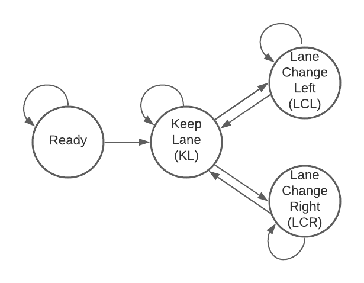

# Path Planning Project

### Project Description

>  In this project, your goal is to design a path planner that is able to create smooth, safe paths for the car to follow along a 3 lane highway with traffic. A successful path planner will be able to keep inside its lane, avoid hitting other cars, and pass slower moving traffic all by using localization, sensor fusion, and map data.

See full description for the project in [here](https://github.com/linyilu0323/CarND_P7_PathPlanning/blob/master/Project_Instructions.md).

------

### Introduction

In this project, what you're provided:

- Road map: a list of waypoint data `[x, y, s, dx, dy]` containing each point's global map "x-y" position, Frenet coordinate "s" position, and the Frenet "d" unit vector (points perpendicular to the road in the right hand side direction).
- Main car's localization data: contains `x, y, s, d, yaw, speed` information of the main car.
- Sensor fusion data: contains all the information about the cars on the right-hand side of the road, the format for each car is: `[id, x, y, vx, vy, s, d]`.
- Previous path data given to the planner.

It is desired to generate a pair of `[x, y]` coordinates for the car to follow every 20ms.

### Implementation Details

Follow the guidance in the Q&A video, below is how I completed the requirements and achieved the goal:

1. **Stay in the Lane:** The first step I took is to disregard all the traffic, and just let the car follow the way points. From the simulator result shown above, as expected, we're having some collision. Another issue is that we're violating acceleration and jerk limits whenever the car takes a new waypoint since these points are not smoothed, so we need to implement some jerk minimizing algorithms.

   

   

2. **Smoothing:** In this part, we're going to try making the car drive a bit smoother in the curves, so it does not violate any jerk and acceleration limits. The idea here is to: (1) first come up with two "starting points"; (2) after we got these two points, we'll add 3 more points, that are 30, 60, and 90 meters away. (3) We will then construct a spline using the provided `spline.h` function using the 5 points we got earlier. (4) Then, with the constructed spline, we can look up  `(x, y)` waypoint vectors that gives us appropriate vehicle speed. The result from this step looks like below, the car eventually ended up rear-ending other cars in the lane since we're still disregarding all other traffics, but the trajectory is much smoother now and we don't see any violation to acceleration and jerk limits except for the begining. 

   

	The magic part about this trajectory generation algorithm (Lines 198~305 in `main.cpp`) is that it takes two inputs only: `ref_vel` and `lane`, in this way, we parameterized the lane trajectory generation so it can be applied to below steps as well: the collision avoidance and lane changing scenario.

3. **Collision Avoidance:** In this step, we implemented an additional feature to let the car accelerate and decelerate based on the distance between ego car and the car in front of it in the same lane. It's very similar to "adaptive cruise control" feature which most cars now have - accelerate if there is car in front and decelerate if not. The result looks much better than previous step, the car is now able to decelerate and follow behind the white car in front of it. I noticed this implementation of ACC feature is not that smart as the car accelerate and decelerate at a constant rate, however it should be doing some close-loop control to maintain a minimum safety distance, I'll leave this as-is for now. I'm hoping to add some PID controller after next project is done.

   

   

4. **Lane Change:** As a final goal, we want the car to be able to change lanes if needed. To do this, I referred back to Lesson 9 "Behavioral Planning", where we talked about Finite State Machines. I decided to implement a simple FSM as shown in below state diagram. The output from this FSM is to help determine the `lane` parameter, we can easily use that to feed into the spline functions we created in previous step to implement the lane change action.

   

   To facilitate the transition, in addition to the `front_too_close` flag I created in previous step, which indicates if the car is too close to the car in front in the current lane. I created two additional flags:

   - `left_too_close` indicates if there is any car within a safe distance in the lane to the left;
   - `right_too_close` indicates if there is any car within a safe distance in the lane to the right;

### Results and Discussion

Below is the final results I got from the simulator, the full result video can be accessed via link below.

#### **A self check against the rubrics:**

:white_check_mark: The car is able to drive at least 4.32 miles without incident. 

:white_check_mark: The car drives according to the speed limit. *- this is probably the easiest deliverable, the vehicle max speed is defined in `const MAX_VEL `which is set to 49.0.*

:white_check_mark: Max Acceleration and Jerk are not Exceeded. *- the maximum acceleration (and deceleration) value is defined in `const MAX_ACC` and `const MAX_DEC` which is both set to 0.224 (equivalent to 5m/s^2)*

:white_check_mark: Car does not have collisions. 

:white_check_mark: The car stays in its lane, except for the time between changing lanes.

:white_check_mark: The car is able to change lanes

:white_check_mark: There is a reflection on how to generate paths. *- you're reading this document*

#### **Discussion:**

- **A simplified Finite-State-Machine:** Lines 161~195 in `main.cpp`, I wrote a very simple FSM by using some "if-else" statements, I did not use any class objects as recommended in Behavioral Planning lesson, nor did I use any cost functions to evaluate the optimum decision. This is of course non-ideal but my solution is based on a simplified FSM structure which only has 3 states.
- **Frequent lane changing:** in an early version of my implementation, I observe the behavioral planner module will sometimes hesitate between two lanes, and decide to go back-and-forth - this will result in the car staying in between two lanes for an extended time. Adding some cost function will definitely help here. I used a simple and straightforward method: just like how human drive, every time we change a lane, we want to stay in that lane for at least a certain time, in the code implementation, I use a timer logic after a lane change, and disable any lane change request before timer expires.

### Future Improvements

- **Distance-keeping with front car:** As mentioned earlier, because we accelerate and decelerate at a constant rate, so when we detect a car in front of us, the distance-keeping looked very weird. I think adding some PID control to the distance itself (this will require adding another state in FSM - "Following" or "Distance Keeping") rather than just using constant acceleration would help.
- **Implement an FSM with cost functions:** For a future improvement, it will be desired to add more states in FSM (e.g. Following, Prep to change lane states, etc.) so we're more thorough in dealing with all kinds of driving scenario, and to add some cost functions to help make better and more robust decisions.

